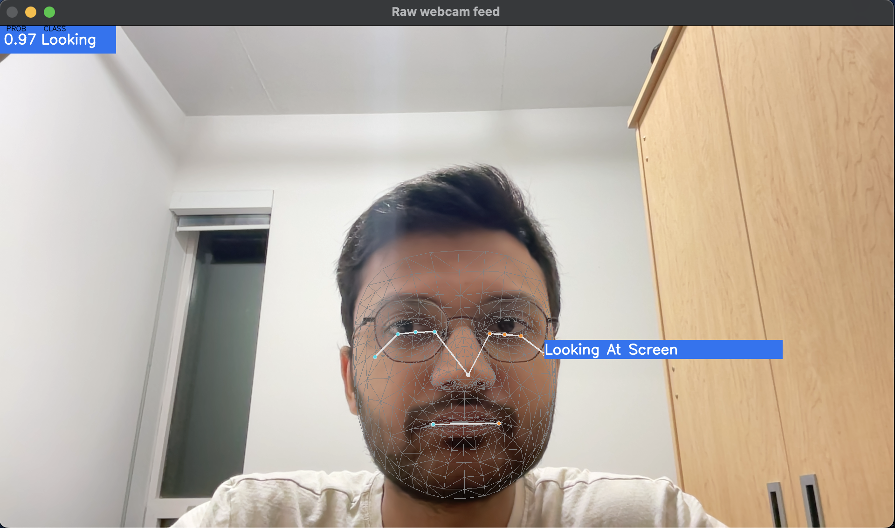

# AI Body Language Decoder

## Introduction
The AI Body Language Decoder is a cutting-edge application that leverages the power of MediaPipe to detect and interpret body language in real-time using a webcam. This project utilizes advanced machine learning techniques to analyze pose, facial expressions, and hand gestures, providing insights into the body language of individuals.

## Features
- Real-time detection of body language.
- Integration with MediaPipe for pose, face, and hand landmark detection.
- Predictive modeling to classify different body language signals.
- Visual display of detection results and predictions.

## Prerequisites
- Python 3.x
- OpenCV
- MediaPipe
- Pandas
- Numpy
- Pickle

## Installation
To set up the AI Body Language Decoder, follow these steps:

1. **Clone the Repository**

2. **Install Dependencies**

`pip install opencv-python`

`pip install mediapipe`

`pip install pandas`

`pip install numpy`

3. **Load the Pre-trained Model**
Ensure you have the `body_language.pkl` model file in the project directory.

## Usage
To run the AI Body Language Decoder, execute the following command:
python run.py

- The application will activate the webcam.
- Start performing gestures or poses in front of the camera.
- The application will display the detected body language class and its probability.

## Sample Outputs
- Face, hand, and pose detection samples:

  

## Acknowledgements
This project is powered by [MediaPipe](https://google.github.io/mediapipe/), a robust framework for building multimodal applied machine learning pipelines.

